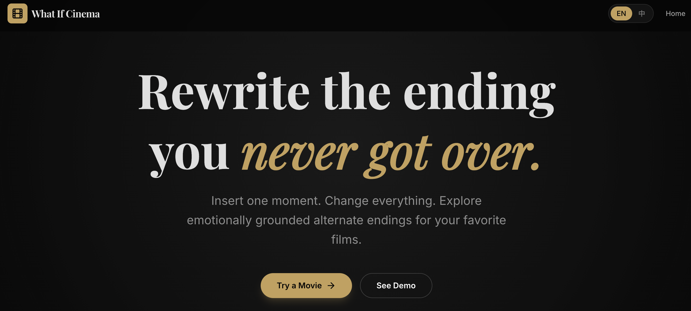
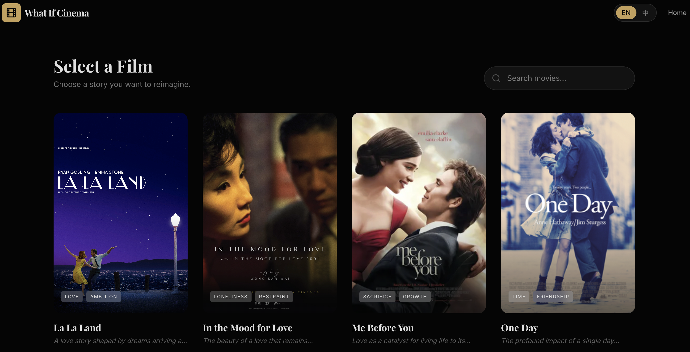
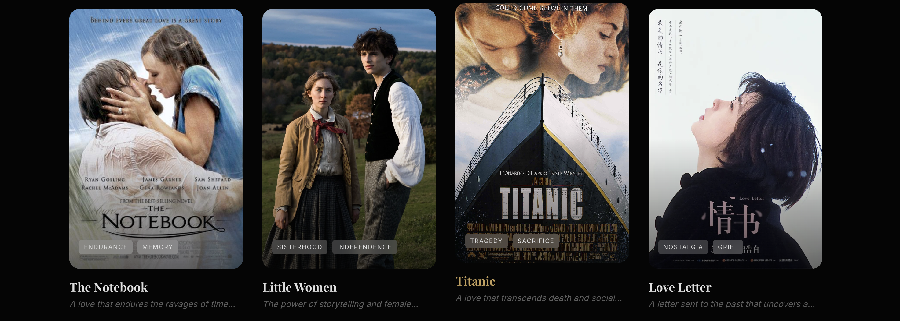
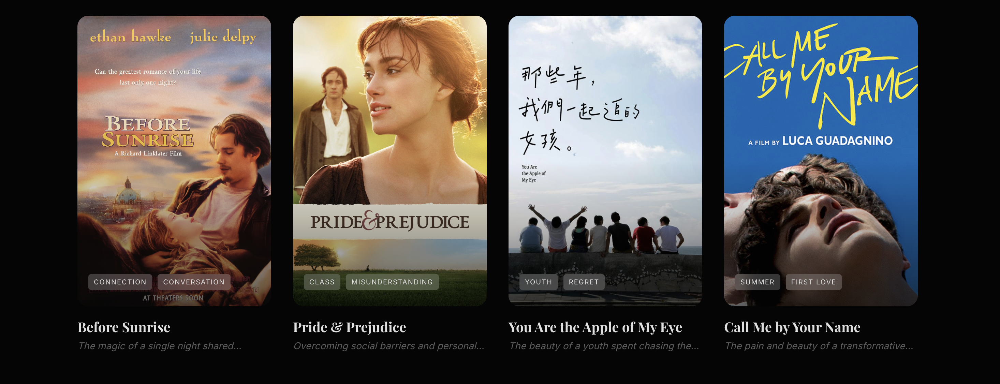
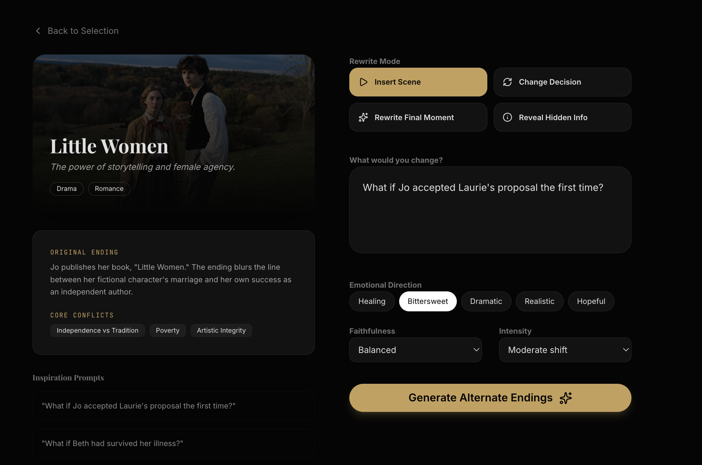
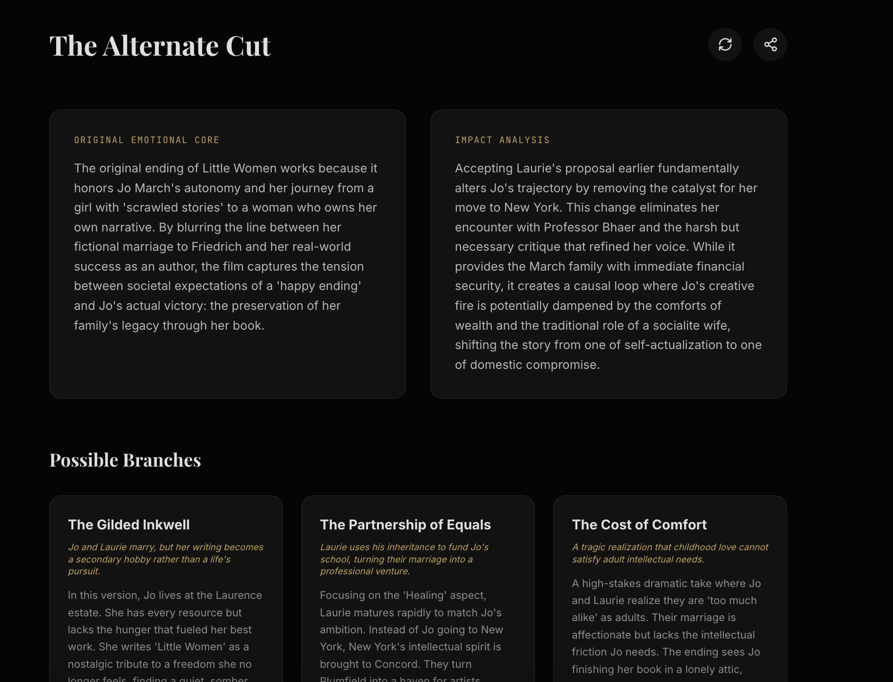
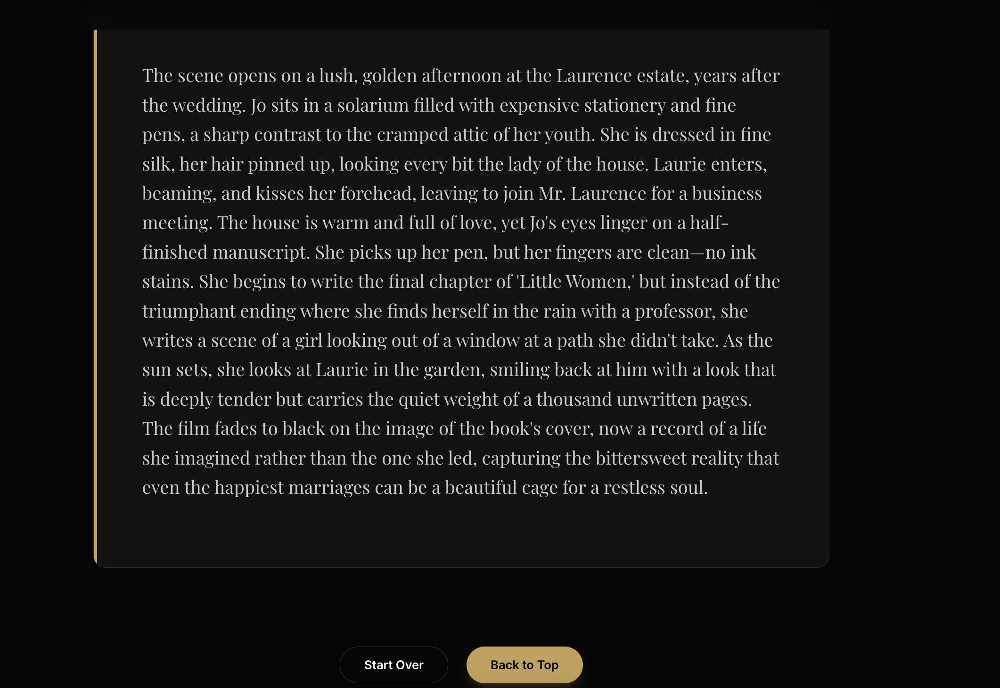

<div align="center">

# What If Cinema

**Rewrite the ending you never got over.**  
*Insert one moment. Change everything.*

An AI storytelling web app that reimagines movie endings through emotionally grounded, causally coherent alternate timelines.

[Live Demo](https://what-if-cinema.vercel.app/) · [GitHub](https://github.com/olivia3395/What_If_Cinema)

</div>


## About

**What If Cinema** is an AI-powered storytelling app for everyone who has ever finished a film and thought:  
**“But what if it ended differently?”**

Instead of generating random fan fiction, the app preserves the emotional soul of the original story while exploring alternate endings that still feel true to the film’s tone, characters, and emotional logic.

Users can:

- insert a new scene
- change a character’s decision
- rewrite the final moment
- reveal hidden information

The system then analyzes how that change reshapes the emotional arc, character dynamics, and ending itself — generating multiple plausible branches, from faithful and bittersweet to healing or dramatic.

> **Not every ending needs to be undone. But some deserve to be imagined differently.**


## Features

- **Curated film selection** with rich emotional metadata
- **Multiple rewrite modes**  
  - Insert Scene  
  - Change Decision  
  - Rewrite Final Moment  
  - Reveal Hidden Info
- **Emotion-aware controls**  
  - Healing  
  - Bittersweet  
  - Dramatic  
  - Realistic  
  - Hopeful
- **Structured alternate ending generation**
  - Original emotional core
  - Impact analysis
  - Possible narrative branches
  - Full rewritten ending
- **Bilingual interface** (English / 中文)
- **Cinematic dark-mode UI** designed for immersive storytelling


## Screenshots

### Home Page




### Film Selection








### Rewrite Builder




### Generated Alternate Ending






## How It Works

1. **Select a film**  
   Choose a story you want to reimagine.

2. **Pick a rewrite mode**  
   Insert a scene, change a decision, rewrite the ending, or reveal hidden information.

3. **Describe your “what if”**  
   Example:  
   *What if Jo accepted Laurie’s proposal the first time?*

4. **Choose an emotional direction**  
   Healing, bittersweet, dramatic, realistic, or hopeful.

5. **Generate alternate endings**  
   The app returns:
   - the original emotional core
   - a causal impact analysis
   - several possible branches
   - a polished rewritten ending


## Tech Stack

- **Next.js**
- **React**
- **TypeScript**
- **Tailwind CSS**
- **Gemini API**
- **Vercel** for deployment


## Run Locally

### Prerequisites
- **Node.js**
- A valid **Gemini API key**

### Setup

Install dependencies

```bash
npm install
